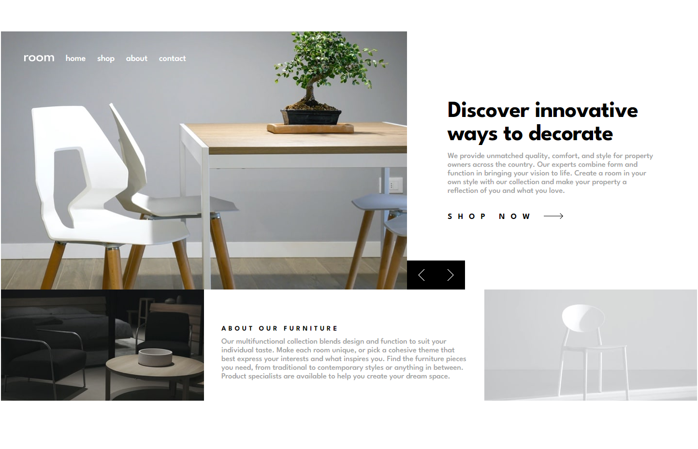

# Frontend Mentor - Room homepage solution

This is a solution to the [Room homepage challenge on Frontend Mentor](https://www.frontendmentor.io/challenges/room-homepage-BtdBY_ENq). Frontend Mentor challenges help you improve your coding skills by building realistic projects.

## Table of contents

- [Overview](#overview)
  - [The challenge](#the-challenge)
  - [Screenshot](#screenshot)
  - [Links](#links)
- [My process](#my-process)
  - [Built with](#built-with)
  - [What I learned](#what-i-learned)
- [Author](#author)

**Note: Delete this note and update the table of contents based on what sections you keep.**

## Overview

This project utilizes grid display to align item for desktop version. The grid is set to column

### The challenge

Users should be able to:

- View the optimal layout for the site depending on their device's screen size
- See hover states for all interactive elements on the page
- Navigate the slider using either their mouse/trackpad or keyboard

### Screenshot


.png>)

### Links

- Solution URL: [https://github.com/juarezv90/room-homepage-master](https://github.com/juarezv90/room-homepage-master)
- Live Site URL: [https://juarezv90.github.io/room-homepage-master/](https://juarezv90.github.io/room-homepage-master/)

## My process

### Built with

- Semantic HTML5 markup
- CSS custom properties
- Flexbox
- CSS Grid
- Mobile-first workflow
- Javascript

### What I learned

Learned some control using setInterval to manage swiping through items

```js
let interval = setInterval(() => {
  nextItem();
}, 5000);
```

Utilizing clear interval to make sure if a user clicks next it does not just keep swiping forward but instead resets the interval

```js
rightTrigger.onclick = () => {
  clearInterval(interval);
  nextItem();
  interval = setInterval(() => {
    nextItem();
  }, 5000);
};

leftTrigger.onclick = () => {
  clearInterval(interval);
  prevItem();
  interval = setInterval(() => {
    nextItem();
  }, 5000);
};
```

Made sure html followed semantics and also utilizing the role attribute

```html
<ul role="navigation" id="desktop-nav">
  <li role="link"><a href="#">Home</a></li>
  <li role="link"><a href="#">Shop</a></li>
  <li role="link"><a href="#">About</a></li>
  <li role="link"><a href="#">Contact</a></li>
</ul>
```
## Author

- Website - [Victor Juarez](https://victorjuarez.dev)
- Frontend Mentor - [@juarezv90](https://www.frontendmentor.io/profile/juarezv90)
